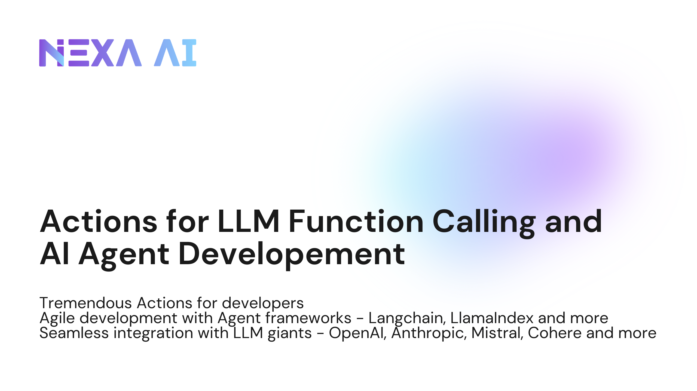

# Open Actions

<h1 align="center">
    <picture>
        <source media="(prefers-color-scheme: dark)" srcset="data/banner-dark.jpeg">
        <source media="(prefers-color-scheme: light)" srcset="data/banner-light.png">
        
    </picture>
</h1>

Welcome to our vibrant Open Actions Repo! 🌟 Here, we present an extensive collection of APIs that offer developers and AI enthusiatists seamless, free, and open-source integration options with the forefront of Large Language Model innovation.

Our Actions can integrate with the most influential names (but are not limited to) in the LLM area : OpenAI, Anthropic, Mixtral, Cohere, LangChain, LLamaIndex, etc.

